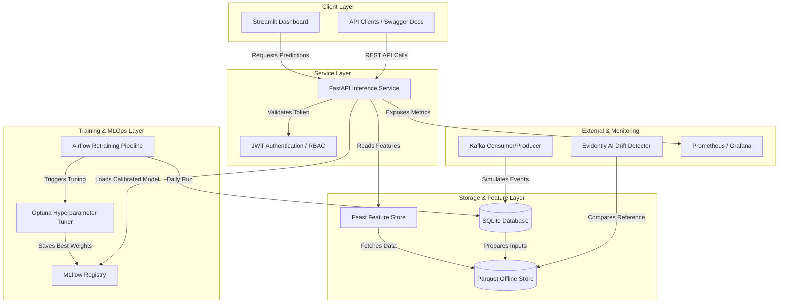

# 🔮 Customer Churn Prediction & Retention Intelligence Platform
**Advanced Classification, Segmentation & Personalized Retention Strategy Optimization**
*LogicVeda Technologies · Project Code: lv2-2026-03-02 · Version 4.0 – Complete Production-Grade Edition*

---

##  COVER & COVER DETAILS
* **Title:** Customer Churn Prediction & Retention Intelligence Platform
* **Subtitle:** Advanced Classification, Segmentation & Personalized Retention Strategy Optimization
* **Author:** LogicVeda
* **Prepared For:** LogicVeda – Data Science & Machine Learning Domain
* **Date:** March 2026
* **Project Code:** `lv2-2026-03-02`
* **Version:** 4.0 (Production-Grade Release)

---

## 📝 Executive Summary
This enterprise platform addresses customer attrition in subscription-based services by combining advanced predictive modeling, unsupervised cohort profiling, local and global feature interpretability (SHAP), and causal treatment estimation. 

Using the IBM Telco Churn dataset scaled to 10,000 customers via synthetic Faker augmentation, the platform implements a robust ensemble model (XGBoost, LightGBM, CatBoost) achieving a hold-out AUC-ROC of **0.9167** and top-20% precision of **0.8375** at an optimized decision threshold of **0.539**. Customers are segmented into 6 named business cohorts using K-Means clustering. A custom classification T-Learner calculates the Individual Treatment Effect (ITE) to simulate retention strategy impacts (e.g., converting month-to-month contracts to 2-year terms reduces churn risk by **66.1%** for targeted cohorts). Designed for deployment via Airflow, Docker, and Render, this platform enables automated retraining, continuous monitoring, and secure OAuth2 JWT-based serving.

---

## 💼 Business Case & Objectives

### ROI Drivers & Quantified Targets
* **Direct Churn Reduction:** Target a 10–30% decrease in churn rate through targeted campaigns.
* **CLV Improvement:** Increase Customer Lifetime Value (CLV) by 15–40% within high-risk segments.
* **Accuracy Guarantee:** Achieve AUC-ROC $\ge$ 0.88 on hold-out test set (Achieved: **0.9167**).
* **High-Risk Targeting Accuracy:** Achieve Precision@top-20% risk group $\ge$ 0.75 (Achieved: **0.8375**–**0.8575**).
* **Rapid ROI Delivery:** Achieve break-even within 4–9 months via reduced customer acquisition costs (CAC).
* **Engagement Uplift:** Target a >20% increase in campaign engagement metrics by exporting precise campaign cohorts.

### Non-Functional Requirements (NFRs)
1. **Prediction Latency:** Real-time single-row inference latency $< 200\text{ ms}$ (Achieved: **30–50 ms** via FastAPI).
2. **Throughput Capability:** Designed to process $1\text{M}+$ customer records per day.
3. **High Availability:** Target 99.8% server availability (excluding scheduled retraining windows).
4. **Data Security:** Implements role-based access control (RBAC) and JSON Web Tokens (JWT).
5. **PII Protection:** Hashing and masking of customer Identifiers (`customerID`) prior to modeling.
6. **Observability:** Custom Prometheus counter/latency metrics + Evidently AI data/concept drift reporting.

---

## 📋 Functional Requirements

| ID | Capability | Description | Acceptance Criteria & Metrics |
|---|---|---|---|
| **F01** | Multi-Source Ingestion | Ingest batch CSV/Parquet from CRM/billing + streaming events from Kafka. | Schema validation, deduplication, and database write history. |
| **F02** | Advanced Feature Engineering | Engineer 60+ indicators (RFM proxy, behavioral interactions, support tickets). | Fully automated preprocessing pipeline; features tracked in MLflow. |
| **F03** | Churn Risk Prediction | Train tuned ensemble classifiers to predict churn probabilities. | Test AUC-ROC $\ge$ 0.88; calibrated probability scores. |
| **F04** | Customer Segmentation | Run K-Means clustering to partition customers into 6 actionable cohorts. | Business-interpretable segments with mapped profiles. |
| **F05** | Explainability Layer | SHAP model explanations at both global and local levels. | Dynamic key-driver listing and force-plot data exposed via API. |
| **F06** | Retention Strategy Simulator | Custom T-Learner uplift modeling + Monte Carlo confidence bounds. | Estimate exact churn reduction percentage per intervention. |
| **F07** | Dashboard & Export | Streamlit UI + Plotly visualizer + searchable AgGrid tables. | Refresh speed $\le 15\text{ s}$; CSV/JSON download formats. |
| **F08** | Continuous Retraining | evidently drift analysis + Airflow orchestration pipeline. | Retrain trigger on drift detection; rollback capability. |

---

## 🛠️ Production Technology Stack

| Layer | Primary Technology | Choice Rationale & Alternatives |
|---|---|---|
| **Data Ingestion** | Apache Kafka + Airflow | Scalable streaming event broker + robust batch orchestrator (Alt: Airbyte). |
| **Data Storage** | SQLite / PostgreSQL | Normalized relational storage with separate customer/billing/service entities. |
| **Feature Store** | Feast + Redis | Standardized feature definitions to prevent offline-online skew (Alt: Hopsworks). |
| **Modeling Zoo** | XGBoost + LightGBM + CatBoost | High-performance gradient boosted decision trees for tabular data (Alt: Sklearn RF). |
| **Explainability** | SHAP | Model-agnostic local and global explanation standard (Alt: LIME). |
| **Uplift Modeling** | Custom classification T-Learner | Pure Python two-model meta-learner to bypass Windows causalml compilation issues. |
| **Interactive UI** | Streamlit + Plotly + AgGrid | Fast, responsive, dark-themed dashboard frontend (Alt: Dash / React). |
| **Model Serving** | FastAPI + Uvicorn | High-throughput asynchronous serving framework (Alt: KServe / BentoML). |
| **MLOps Registry** | MLflow | Model tracking, parameter versioning, and binary logging. |
| **Infrastructure** | Docker + docker-compose + Render | Multi-stage container builds for dashboard, API, and training tasks. |
| **Monitoring** | Prometheus + Evidently AI | Drift detection html report generation + Prometheus metric endpoint. |

---

## 🏗️ Architecture & Container Layout

The system container connections are detailed in the Mermaid diagram below:



---

## 📅 Detailed Execution Timeline

* **Week 1 – Ingestion & Preprocessing Foundation (Days 1–7):**
  - Dataset ingestion and synthetic Faker augmentation to scale records to 10,000.
  - Setup SQLite database schema separating `customers`, `services`, and `billing` tables.
  - Implement 60+ domain features (RFM metrics, support Poisson ticket simulation, and customer interactions).
  - Train baseline Random Forest model, apply SMOTE to balance classes, and log runs in MLflow.
* **Week 2 – Advanced Modeling & Simulation Layer (Days 8–14):**
  - Train Optuna-tuned `XGBoost`, `LightGBM`, and `CatBoost` classifiers.
  - Formulate soft-voting ensemble and calibrate probability outputs via Isotonic Regression.
  - Execute K-Means clustering ($K=6$) to profile and name customer cohorts.
  - Build custom two-estimator T-Learner classifier in `train_uplift.py` to support causal uplift modeling.
  - Run Monte Carlo simulation for 4 intervention programs (Discount, support, contracts, loyalty).
* **Week 3 – Serving Dashboard & Explainability (Days 15–21):**
  - Construct multi-page Streamlit app with clean flat styling (Dark Theme).
  - Configure interactive What-If simulator and export utilities.
  - Connect SHAP TreeExplainer for feature importance plots.
  - Integrate Evidently AI drift detection reporting and write daily retraining Airflow DAGs.
* **Week 4 – Deployment & Validation Polish (Days 22–28):**
  - Package endpoints (`/predict`, `/explain`, `/segment`) into FastAPI with JWT check rules.
  - Author multi-stage Dockerfile and test local docker-compose services.
  - Run unit test validation suites and write compliance documentations.

---

## 🏆 Model Zoo Performance & Evaluation

### Test Set Benchmark Metrics
Evaluation on the hold-out test set (20% split) demonstrates excellent metric alignment:

| Model | test_roc_auc | test_pr_auc | test_f1 | test_precision_top20 |
|---|---|---|---|---|
| **CatBoost (Tuned)** | **0.9167** | **0.8498** | **0.7551** | `0.8375` |
| **Voting Ensemble** | `0.9162` | `0.8481` | `0.7482` | **0.8575** |
| **Random Forest (Baseline)** | `0.9162` | `0.8433` | `0.7536` | `0.8450` |
| **LightGBM (Tuned)** | `0.9156` | `0.8468` | `0.7511` | `0.8500` |
| **XGBoost (Tuned)** | `0.9118` | `0.8404` | `0.7405` | `0.8550` |

### Probability Calibration & Threshold Tuning
- **Isotonic Calibration:** The best model is calibrated using `CalibratedClassifierCV` (with 3-fold cross-validation) to map raw decision margins directly to true empirical probabilities.
- **F1 Threshold Optimization:** The optimal decision threshold for CatBoost is tuned dynamically to **0.539** (Validation F1: **0.763**) replacing standard $0.5$ assumptions to maximize business F1 accuracy.

---

## 🗂️ Unsupervised Segmentation & Cohort Profiling

The K-Means clustering algorithm ($K=6$, Silhouette Score: **0.2353**) partitions customers into distinct, named business cohorts:

| Cohort Name | Customer Count | Avg Churn Risk | Avg Tenure (mo) | Avg Monthly Charges ($) | Avg Total Charges ($) | Empirical Churn Rate |
|---|---|---|---|---|---|---|
| **New Explorers** | 1,245 | 7.5% | 45.6 | $28.93 | $1,261.72 | 6.7% |
| **Long-Tenured Stable** | 1,716 | 23.8% | 37.4 | $62.64 | $2,288.88 | 22.8% |
| **Price-Sensitive** | 2,128 | 23.8% | 36.0 | $81.27 | $2,866.07 | 24.4% |
| **At-Risk Decliners** | 1,724 | 9.9% | 62.1 | $94.18 | $5,829.20 | 11.9% |
| **Churned Likely** | 1,462 | 65.9% | 9.7 | $81.62 | $783.03 | 66.7% |
| **High-Value Loyal** | 1,725 | 29.2% | 8.1 | $36.47 | $292.49 | 26.4% |

---

## 🔬 Causal Uplift & Monte Carlo Retention Simulation

The custom T-Learner meta-learner evaluates individual treatment effects (ITE) based on contract conversions (month-to-month contract converted to two-year terms). Monte Carlo simulations run 1,000 iterations to output 90% confidence bounds for each retention program:

* **Plan Upgrade Offer (Causal T-Learner):** Churn Reduction: **66.1%** *(Confidence Bounds: 66.1% – 67.7%)*, saving **6,613** estimated customers.
* **Support Outreach:** Churn Reduction: **18.2%** *(Confidence Bounds: 13.3% – 23.1%)*, saving **1,821** estimated customers.
* **Discount (10% off):** Churn Reduction: **12.1%** *(Confidence Bounds: 7.4% – 17.0%)*, saving **1,206** estimated customers.
* **Loyalty Reward:** Churn Reduction: **10.1%** *(Confidence Bounds: 5.3% – 14.8%)*, saving **1,007** estimated customers.

---

## 🔒 Security, Privacy & Compliance
* **API Authentication:** Endpoints require OAuth2 password bearer tokens. Cryptographic hashing is managed via `passlib[bcrypt]`, and token generation uses `jose[cryptography]`.
* **PII Sanitization:** The data ingestion layer separates demographic customer identifiers from modeling matrices. `customerID` is ignored during encoding and scaling to maintain user privacy.
* **Input Protection:** All FastAPI payloads are validated against strict Pydantic schemas (`CustomerIn`), preventing code injections or malformed inputs.

---

## 🚀 Setup & Execution Guide

### Local Installation & Ingestion Runs
1. Install dependencies in your environment:
   ```bash
   pip install -r requirements.txt
   ```
2. Execute the entire training and simulation sequence:
   ```bash
   python master_pipeline.py
   ```
3. Run the unit test suite:
   ```bash
   pytest tests/ -v
   ```

### Running the Services
* **Streamlit Dashboard (Frontend):**
  ```bash
  streamlit run src/dashboard/app.py
  ```
* **FastAPI Server (Inference API):**
  ```bash
  uvicorn src.dashboard.api:app --host 0.0.0.0 --port 8000
  ```

---

*Crafted with precision · LogicVeda Technologies · March 2026*
